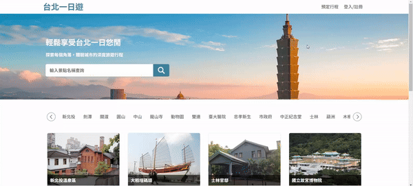
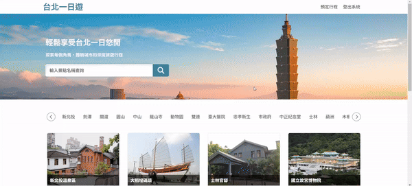
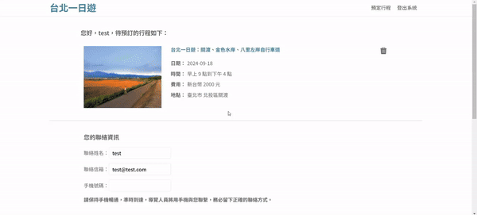
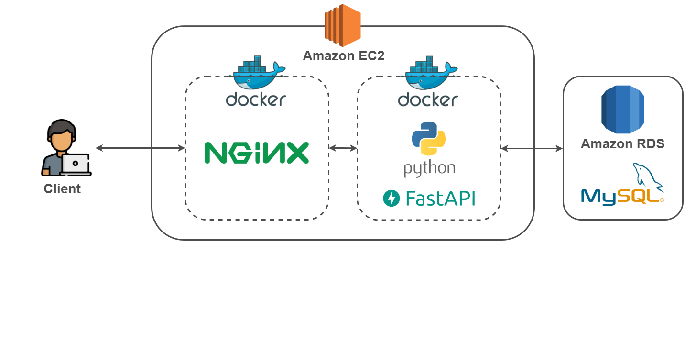
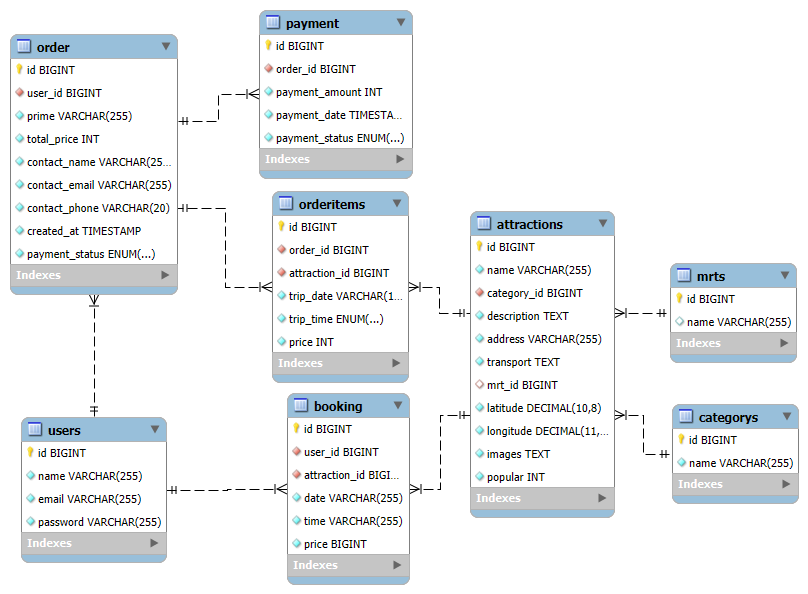

# 台北一日遊

### A tourism e-commerce webite which users can explore and book favorite attractions with ease.

### Table of contents

- [Main Features](#main-features)
- [Demo](#demo)
- [Server Architecture](#server-architecture)
- [Database Schema](#database-schema)
- [Technique](#technique)
- [Contact](#contact)

---

### Main Features

- Member system
- Search for information on attractions in Taipei
- Book tours and add them to cart
- Complete payment by using TapPay

---

### Demo

- Member system: Login by creating an account.

- Search for information on attractions in Taipei: Scroll down to the bottom of the homepage to automatically load more attractions, and enter keywords or click on MRT station names to find specific attractions.

- Book tours and add them to cart: Users can only add one tour to cart at a time.

- Complete payment by using TapPay: Users will receive order number after paying successfully.

---

### Server Architecture

---

### Database Schema

---

### Technique

- Front-End
    - HTML, CSS, JavaScript
- Back-End
    - Web Framework : Python FastAPI
    - Database : MySQL
    - Container : Docker
    - Reverse Proxy : Nginx
    - Cloud : AWS RDS, Route 53
    - Third-Party : TapPay SDK
    - Design Pattern : MVC

---

### Contact
 **許珮萱 Pei Hsuan Hsu**  
 Email: [hsupei0514@gmail.com](mailto:hsupei0514@gmail.com)  
 LinkedIn: [Pei Hsuan Hsu](https://www.linkedin.com/in/pei-hsuan-hsu-0841a52bb/)
